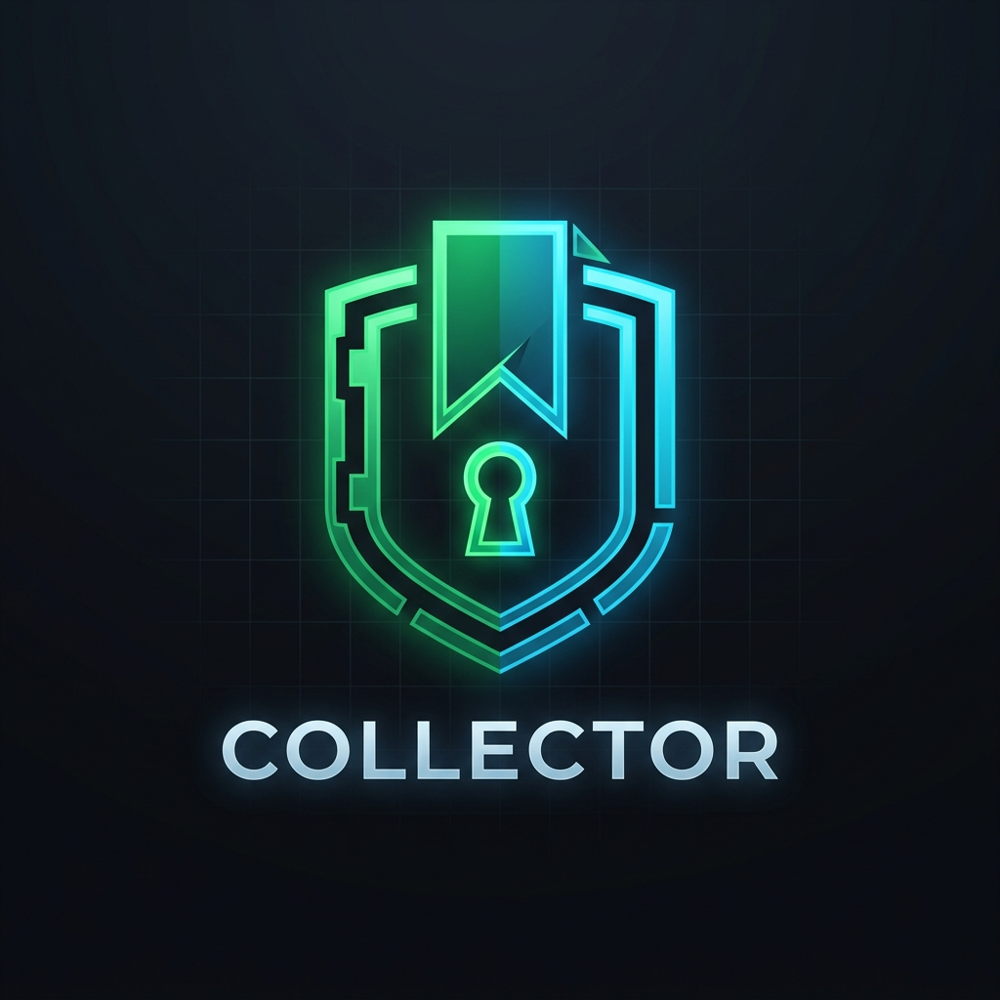

# 📌 Collector — Developer Resource & Vault Saver



> **Collector** is a high-productivity, zero-friction developer bookmarking application, repository vault, and AI-powered resource management tool built with **Next.js 15**, **Supabase**, **TypeScript**, and **Tailwind CSS**.

---

## ✨ Features

- ⚡ **Zero-Friction Link Capture**: Save links instantly from direct URLs or social posts (**Threads, Instagram, YouTube, Twitter/X, GitHub**).
- 🐙 **Dedicated GitHub Repo Vault**: Automatically imports and organizes repositories with live ⭐ stars, 🍴 forks, primary language dots 🟢, `git clone` quick copy, and 1-click **VS Code Web** (`vscode.dev`) launcher.
- 🧩 **Right-Click Chrome Extension**: Includes a Manifest V3 browser extension allowing you to right-click *any link* on any website and select **"📌 Share link to Collector"**.
- 📱 **Native Mobile Share Sheet**: Web App Manifest with PWA Share Target (`/share-target`) for native 1-tap sharing from iOS Safari and Android Chrome.
- 🤖 **Telegram Saver Bot**: Connect your private Telegram bot to auto-save links and captions directly from mobile messaging.
- 🛡️ **Duplicate Prevention & Accidental Delete Safety**: Automatic URL normalization bumps duplicate links to the top instead of creating clutter, combined with a red safety confirmation modal before resource deletions.
- 📅 **Date Stamps, Date Range Filters & Sorting**: Visible relative date badges (`2d ago`, `Yesterday`) with filtering by **All Time**, **Today**, **This Week**, and **This Month**.
- 🤖 **Automated AI Key Takeaways**: Auto-generates structured 3-bullet AI summaries and automatically tags resources into categories (*Open Source, AI/ML Tools, Embedded/IoT, Design Inspiration, Reels/Shorts, Reads/Threads*).
- 🗄️ **Dual Persistence Engine**: Real-time sync with Supabase PostgreSQL cloud database + local disk fallback storage (`data/items.json`).

---

## 🚀 Quick Start

### 1. Clone & Install Dependencies
```bash
git clone https://github.com/annamalai2912/Collector.git
cd Collector
npm install
```

### 2. Configure Environment Variables
Create a `.env.local` file in the root directory:
```env
NEXT_PUBLIC_SUPABASE_URL=https://xpmiwaydervbhvrhzriu.supabase.co
NEXT_PUBLIC_SUPABASE_ANON_KEY=sb_publishable_d51TpKNxMjswJcT2p6vNPA_BQg5WTR-
NEXT_PUBLIC_SUPABASE_PUBLISHABLE_KEY=sb_publishable_d51TpKNxMjswJcT2p6vNPA_BQg5WTR-
TELEGRAM_BOT_TOKEN=8902693986:AAE9q8gqOUQJQuXEkQAFaA46-HkSt3fQ3Yo
```

### 3. Run Development Server
```bash
npm run dev
```
Open [http://localhost:3000](http://localhost:3000) in your browser.

---

## 🧩 Installing the Right-Click Chrome Extension

1. Click the **`🧩 Extension`** button in the app header to download `collector-extension.zip`.
2. Extract `collector-extension.zip` on your computer.
3. Open Chrome / Edge / Brave and navigate to `chrome://extensions`.
4. Enable **Developer mode** (top right toggle), click **Load unpacked**, and select the extracted folder.
5. Right-click any link on any website and select **📌 Share link to Collector**!

---

## 🌐 Deploy to Vercel

1. Import your repository to **Vercel** ([vercel.com/new](https://vercel.com/new)).
2. Add your `NEXT_PUBLIC_SUPABASE_URL` and `NEXT_PUBLIC_SUPABASE_ANON_KEY` environment variables under Project Settings.
3. Click **Deploy**!

---

## 📄 License
MIT License © 2026 Collector
